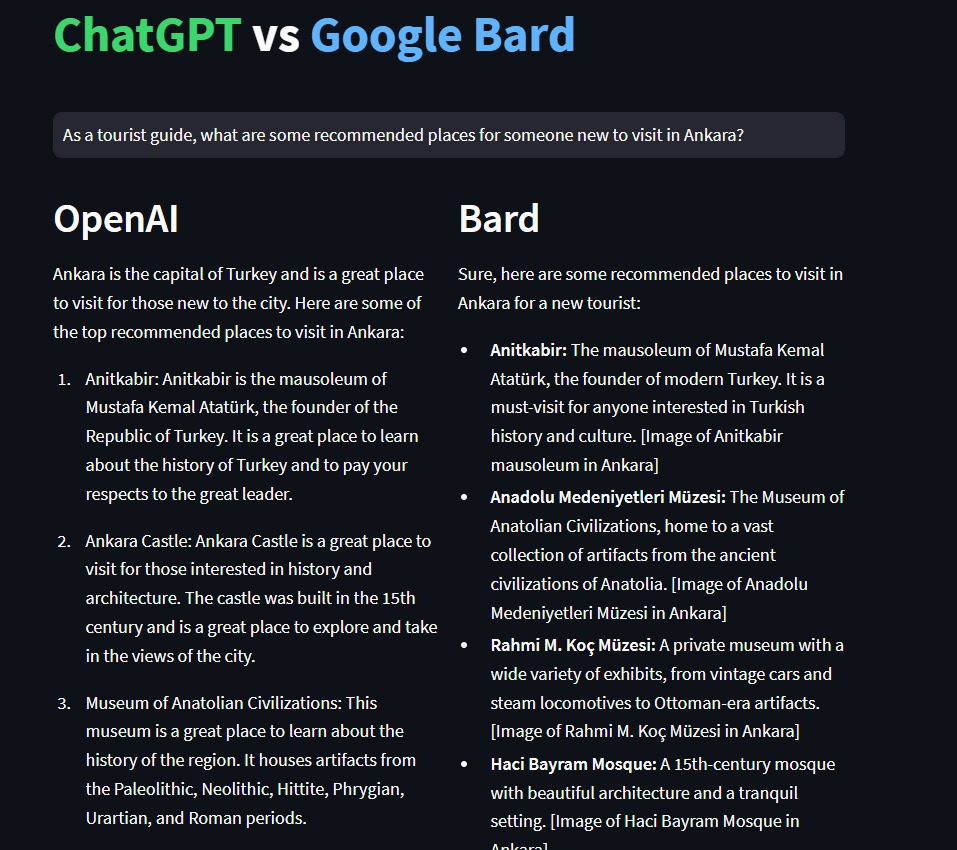
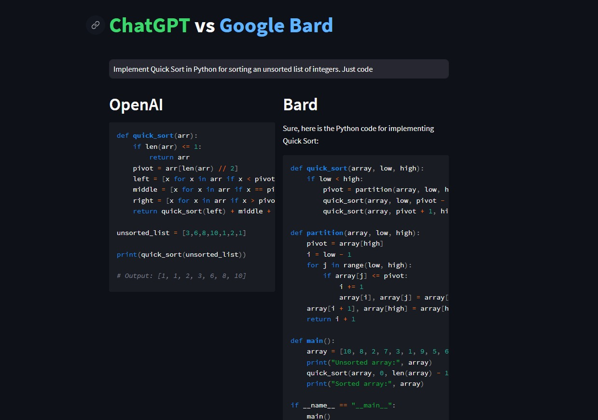

# AI Comparison: OpenAI's ChatGPT vs Google's Bard

This web application leverages Streamlit to create a user-friendly interface where users can enter a question or a prompt and receive responses from two AI models: OpenAI's ChatGPT and Google's Bard. This allows for an easy comparison of the outputs of the two different AI models in real time.
## Examples

 



## Setup

### Requirements

You will need Python and pip installed on your machine. You will also need API keys for OpenAI and Google's Bard.

### Installation

1. Clone this repository to your local machine.
   
2. Install the required Python packages:

   ```bash
   pip install streamlit openai bardapi
   ```

3. Set up your environment variables in `config.py`. Replace `your_openai_api_key` and `your_bard_api_key` with your actual API keys:

   ```python
   import os

   # Set your environment variables
   os.environ["_BARD_API_KEY"] = "your_bard_api_key"
   openai.api_key = "sk-your_openai_api_key"
   ```

### Obtaining API keys

**OpenAI**: To obtain an OpenAI API key, you need to sign up on the [OpenAI website](https://beta.openai.com/signup/). Once you've signed up and logged in, you can find your API key in the API section.

**Google Bard**: To obtain a Bard API key, open Bard in your Chrome browser, right-click and select 'Inspect' or press 'Ctrl + Shift + I', go to 'Application' then look for 'APISID' under 'Cookies'. Copy the value of 'APISID', this is your Bard API key.

## Running the App

Run the following command in your terminal:

```bash
streamlit run main.py
```

## How to Use

1. After running the application, open your web browser and visit `localhost:8501` (or the address provided in your terminal).

2. Enter a prompt into the text input field.

3. The application will generate responses from both ChatGPT and Google Bard, and display them side by side.

## Contact

If you have any questions or feedback, please feel free to reach out.
